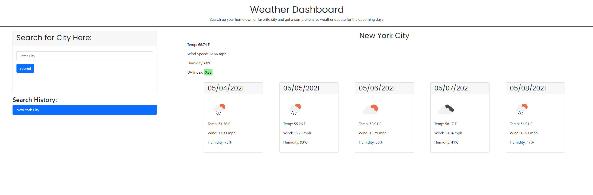
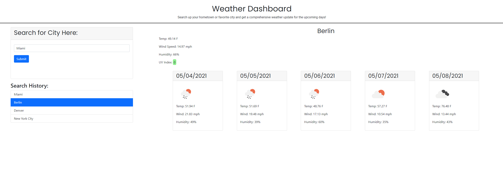

# Weather Dashboard

Your go to place for planning vacations based on the weather! Search up cities around the world for the current forecast and for the next 5 days. Save up to 5 cities in local storage for easy access as you plan your trips. The page defaults to NYC as the premier vacation location!

## Future Features and Challenges

- Would like to add the ability to manually remove items from search history
- No way to specify state/country if a town has the same name in multiple places
- A bad search returns a 404 and some errors

## The Finished Product

Link to deployed site: [https://v1brance.github.io/weather-dashboard/](https://v1brance.github.io/weather-dashboard/)

No history stored in local storage:

Sample page with city selected from history:

### Credits and Contributions

- Bootstrap
- jQuery
- Normalize.css
- OpenWeather API
- moment.JS
